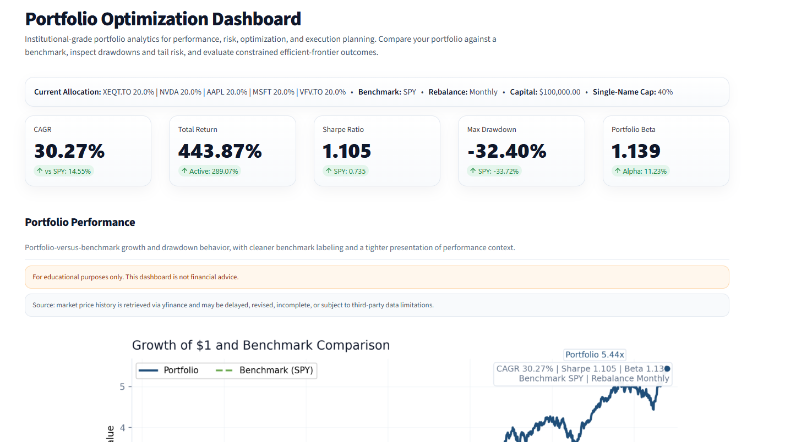
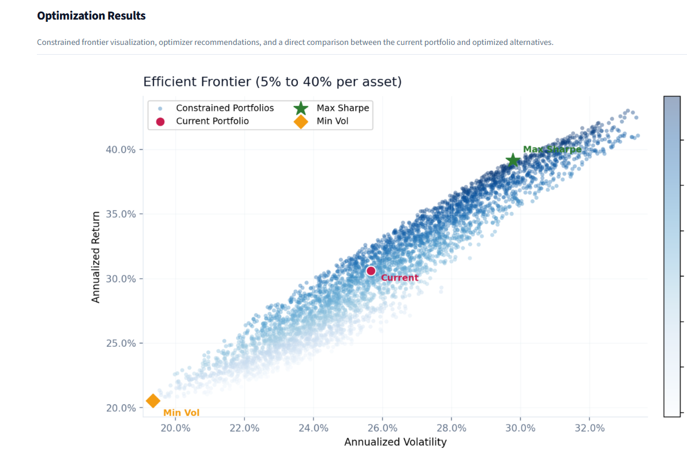
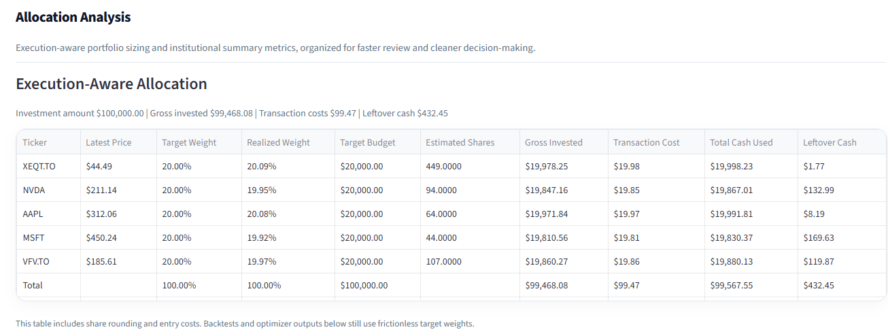
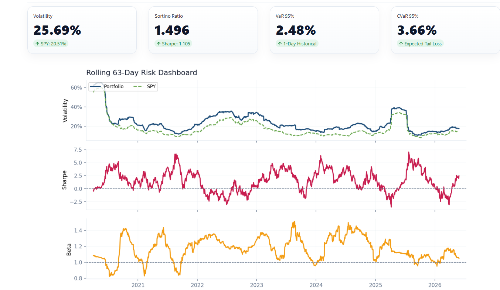

# Portfolio Optimization Dashboard

Interactive portfolio optimization and risk analytics dashboard built in Python and Streamlit using historical market data.

The application allows users to construct and analyze custom multi-asset portfolios with benchmark comparison, risk diagnostics, constrained optimization, and execution-aware allocation modeling.

## Live Demo

https://portfolio-optimization-dashboard-kebr6naz98vgknpamsbg69.streamlit.app/

## Dashboard Preview

### Portfolio Performance


### Efficient Frontier Optimization


### Execution-Aware Allocation


### Risk & Portfolio Analytics


 ## Features

 - Dynamic ticker inputs and portfolio weights
 - Benchmark-relative performance analysis
 - Growth of $1 and drawdown visualization
 - Execution-aware allocation table with adjustable dollar allocation, estimated shares, transaction costs, and leftover cash
 - Performance metrics including CAGR, total return, volatility, alpha, beta, Sharpe ratio, and Sortino ratio
 - Historical Value-at-Risk (VaR) and Conditional VaR (CVaR)
 - Constrained efficient frontier simulation
 - Max Sharpe and minimum volatility portfolio outputs
 - Current vs optimized portfolio comparison
 - Rolling volatility, Sharpe, and beta diagnostics
 - Correlation heatmap for selected holdings

## Methodology

The dashboard uses historical adjusted market data retrieved through yfinance. Portfolio returns are calculated using user-selected asset weights and rebalance frequency. Risk and return metrics are annualized using 252 trading days.

The efficient frontier is generated using constrained Monte Carlo portfolio simulation. The optimizer identifies:
- Maximum Sharpe portfolio
- Minimum volatility portfolio

Portfolio optimization is based on historical returns and covariance estimates

## Assumptions

- Historical returns are not predictive of future returns
- Transaction costs are applied only in the execution-aware allocation table
- Backtests and optimizer calculations use frictionless target weights
- Risk-free rate is assumed to be 2%
- Annualization assumes 252 trading days
- Market data depends on yfinance availability and may be delayed or incomplete

## Disclaimer

This project is for educational and analytical purposes only. It is not financial advice, investment advice, or a recommendation to buy or sell any security.

## Tech Stack

- Python
- Streamlit
- pandas
- NumPy
- Matplotlib
- yfinance
- SciPy

## Project Purpose

This project was developed to demonstrate portfolio analytics, risk modeling, optimization techniques, and interactive financial dashboard development using Python and Streamlit.

## How to Run Locally

```bash
py -m streamlit run app.py
```